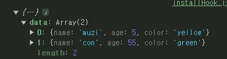
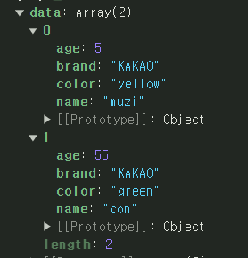
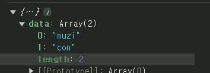

# TANSTACK QUERY SELECT OPTION 사용

tanstack query의 기능중 하나인 select option은 데이터 패칭을 했을때 반환대는 값을 변환시켜주는 속성이다.

해당 속성을 바로 사용해보자

```jsx
const getData = async () => {
  const res = await fetch("/data.json").then((res) => res.json());
  return res;
};

const query = useQuery({
  queryKey: ["data"],
  queryFn: getData,
});
```

tanstack query를 사용하기위해 useQuery를 사용하여 `query Key`와 `query Fn` 을 사용해서 데이터 패칭을 하였다.

여기서 반환대는 값은 `data.json` 에 있는

```json
[
  {
    "name": "muzi",
    "age": 5,
    "color": "yellow"
  },
  {
    "name": "con",
    "age": 55,
    "color": "green"
  }
]
```

이 값이 반환된다.



콘솔을 찍어본 결과 데이터에는 결과값이 잘 담겨져있다.

data 배열 안에 name, age, color 세가지 속성이 들어있다.

하지만 이 값을 가공해서 사용해야하는 경우 `useState`와 `useEffect`를 사용해 새로운 값을 만들어야한다.

```jsx
// 기존 값에 새로운 값을 추가하는경우
const [newData, setNewData] = useState([]);

const query = useQuery({
  queryKey: ["data"],
  queryFn: getData,
});

useEffect(() => {
  // 새로운 brand 라는 속성을 추가한 부분
  if (query) setNewData(query?.data?.map((el) => ({ ...el, brand: "KAKAO" })));
}, [query]);
```

위와 같은 코드이 형태로 사용했을것이다.

위의 코드에서 select 옵션을 사용하면 코드가 훨씬 간결해진다.

```jsx
// 기존 값에 새로운 값을 추가하는경우
const query = useQuery({
  queryKey: ["data"],
  queryFn: getData,
  select: (data)=> select: (data) => data.map((el) => ({ ...el, brand: "KAKAO" })),
});
```

두 코드블럭을 봤을떄 코드가 줄어드는 부분이 크게 보일것이다.

앞으로 가공될 값을 사용하게 될 경우 select라는 옵션을 사용하고,

원본의 값과 가공된 경우의 값을 사용하는 경우, 원본의 값을 가져오고 따로 가공처리를 해줘야할거같다.

<br />
<br />
<br />

## select로 값 바꾸기



```jsx
const query = useQuery({
  queryKey: ["data"],
  queryFn: getData,
  select: (data) => data.map((el) => ({ ...el, brand: "KAKAO" })),
});
```

값을 추가한 경우

<br />
<br />



```jsx
const query = useQuery({
  queryKey: ["data"],
  queryFn: getData,
  select: (data) => data.map((el) => el.name),
});
```

값을 제거한 경우
